RNA-seq Analysis
================
Zoe Dellaert
2026-06-03

- [LCM Low-Input Library Sanity Check
  Pilot](#lcm-low-input-library-sanity-check-pilot)
  - [0. Setup species-specific
    parameters](#0-setup-species-specific-parameters)
  - [1. Read in raw count data](#1-read-in-raw-count-data)
  - [2. Extract metadata from sample
    names](#2-extract-metadata-from-sample-names)
  - [3. Remove outliers, if
    identified](#3-remove-outliers-if-identified)
  - [4. pOverA filtering to reduce
    dataset](#4-povera-filtering-to-reduce-dataset)
    - [Note to self: maybe replace this with treatment-specific
      filtering. To get genes expressed only at one timepoint in one
      treatment](#note-to-self-maybe-replace-this-with-treatment-specific-filtering-to-get-genes-expressed-only-at-one-timepoint-in-one-treatment)
  - [5. Create DESeq object and run
    DESeq2](#5-create-deseq-object-and-run-deseq2)
  - [6. VST-Transforming count data for
    visualization](#6-vst-transforming-count-data-for-visualization)
  - [7. Visualize sample-sample
    relationships](#7-visualize-sample-sample-relationships)
    - [PCA](#pca)
    - [Hierarchical Clustering](#hierarchical-clustering)
    - [Heatmap of variable genes](#heatmap-of-variable-genes)
  - [Preprocessing Summary](#preprocessing-summary)
- [DE Analysis](#de-analysis)
  - [1. Extract results for bulk vs. OralGastro
    contrast](#1-extract-results-for-bulk-vs-oralgastro-contrast)
    - [MA Plots with Log2 Fold Change Transform
      Comparisons](#ma-plots-with-log2-fold-change-transform-comparisons)
  - [2. Extract results for adjusted p-value \< 0.05 with LFC transform
    of choice (or
    none)](#2-extract-results-for-adjusted-p-value--005-with-lfc-transform-of-choice-or-none)
    - [Join with annotation data](#join-with-annotation-data)
    - [Save csvs](#save-csvs)
  - [3. Heatmap of differentially expressed genes, with Swissprot
    annotation](#3-heatmap-of-differentially-expressed-genes-with-swissprot-annotation)
  - [4. Genes of interest](#4-genes-of-interest)
    - [Solute Carrier (SLC) Family
      genes](#solute-carrier-slc-family-genes)
    - [Biomin_genes](#biomin_genes)
    - [Membrane genes](#membrane-genes)
  - [Appendix](#appendix)

# LCM Low-Input Library Sanity Check Pilot

This is a technical pilot to evaluate whether low-input LCM library prep
on microdissected oral gastrodermis tissue from *Porites compressa*
captured expected tissue-specific markers, compared against bulk
whole-tissue references (n=1 OG LCM vs n=2 all-tissue LCM).

This is NOT a powered differential expression analysis. P-values and
padj are reported by DESeq2 but should not be interpreted as evidence of
biological significance. Log2 fold changes are used here as an
enrichment metric (OG vs bulk mixture) for library prep evaluation.

``` r
# set up file paths so that Rmd outputs can be viewed using github markdown
knitr::opts_knit$set(base.dir = normalizePath("/project/pi_hputnam_uri_edu/zdellaert/Porites_LCM_test/output_RNA/reports/"), base.url = "./output_RNA/reports/")

knitr::opts_chunk$set(echo = TRUE, message = FALSE, warning = FALSE,fig.width = 10, fig.height = 8,
                      fig.path = "DE_Analysis_files/figure-gfm/")

#load packages
library(tidyverse)
```

    ## ── Attaching core tidyverse packages ──────────────────────── tidyverse 2.0.0 ──
    ## ✔ dplyr     1.2.1     ✔ readr     2.2.0
    ## ✔ forcats   1.0.1     ✔ stringr   1.6.0
    ## ✔ ggplot2   4.0.3     ✔ tibble    3.3.1
    ## ✔ lubridate 1.9.4     ✔ tidyr     1.3.2
    ## ✔ purrr     1.2.1     
    ## ── Conflicts ────────────────────────────────────────── tidyverse_conflicts() ──
    ## ✖ dplyr::filter() masks stats::filter()
    ## ✖ dplyr::lag()    masks stats::lag()
    ## ℹ Use the conflicted package (<http://conflicted.r-lib.org/>) to force all conflicts to become errors

``` r
library(DESeq2)
```

    ## Loading required package: S4Vectors
    ## Loading required package: stats4
    ## Loading required package: BiocGenerics
    ## Loading required package: generics
    ## 
    ## Attaching package: 'generics'
    ## 
    ## The following object is masked from 'package:lubridate':
    ## 
    ##     as.difftime
    ## 
    ## The following object is masked from 'package:dplyr':
    ## 
    ##     explain
    ## 
    ## The following objects are masked from 'package:base':
    ## 
    ##     as.difftime, as.factor, as.ordered, intersect, is.element, setdiff,
    ##     setequal, union
    ## 
    ## 
    ## Attaching package: 'BiocGenerics'
    ## 
    ## The following object is masked from 'package:dplyr':
    ## 
    ##     combine
    ## 
    ## The following objects are masked from 'package:stats':
    ## 
    ##     IQR, mad, sd, var, xtabs
    ## 
    ## The following objects are masked from 'package:base':
    ## 
    ##     anyDuplicated, aperm, append, as.data.frame, basename, cbind,
    ##     colnames, dirname, do.call, duplicated, eval, evalq, Filter, Find,
    ##     get, grep, grepl, is.unsorted, lapply, Map, mapply, match, mget,
    ##     order, paste, pmax, pmax.int, pmin, pmin.int, Position, rank,
    ##     rbind, Reduce, rownames, sapply, saveRDS, table, tapply, unique,
    ##     unsplit, which.max, which.min
    ## 
    ## 
    ## Attaching package: 'S4Vectors'
    ## 
    ## The following objects are masked from 'package:lubridate':
    ## 
    ##     second, second<-
    ## 
    ## The following objects are masked from 'package:dplyr':
    ## 
    ##     first, rename
    ## 
    ## The following object is masked from 'package:tidyr':
    ## 
    ##     expand
    ## 
    ## The following object is masked from 'package:utils':
    ## 
    ##     findMatches
    ## 
    ## The following objects are masked from 'package:base':
    ## 
    ##     expand.grid, I, unname
    ## 
    ## Loading required package: IRanges
    ## 
    ## Attaching package: 'IRanges'
    ## 
    ## The following object is masked from 'package:lubridate':
    ## 
    ##     %within%
    ## 
    ## The following objects are masked from 'package:dplyr':
    ## 
    ##     collapse, desc, slice
    ## 
    ## The following object is masked from 'package:purrr':
    ## 
    ##     reduce
    ## 
    ## Loading required package: GenomicRanges
    ## Loading required package: Seqinfo
    ## Loading required package: SummarizedExperiment
    ## Loading required package: MatrixGenerics
    ## Loading required package: matrixStats
    ## 
    ## Attaching package: 'matrixStats'
    ## 
    ## The following object is masked from 'package:dplyr':
    ## 
    ##     count
    ## 
    ## 
    ## Attaching package: 'MatrixGenerics'
    ## 
    ## The following objects are masked from 'package:matrixStats':
    ## 
    ##     colAlls, colAnyNAs, colAnys, colAvgsPerRowSet, colCollapse,
    ##     colCounts, colCummaxs, colCummins, colCumprods, colCumsums,
    ##     colDiffs, colIQRDiffs, colIQRs, colLogSumExps, colMadDiffs,
    ##     colMads, colMaxs, colMeans2, colMedians, colMins, colOrderStats,
    ##     colProds, colQuantiles, colRanges, colRanks, colSdDiffs, colSds,
    ##     colSums2, colTabulates, colVarDiffs, colVars, colWeightedMads,
    ##     colWeightedMeans, colWeightedMedians, colWeightedSds,
    ##     colWeightedVars, rowAlls, rowAnyNAs, rowAnys, rowAvgsPerColSet,
    ##     rowCollapse, rowCounts, rowCummaxs, rowCummins, rowCumprods,
    ##     rowCumsums, rowDiffs, rowIQRDiffs, rowIQRs, rowLogSumExps,
    ##     rowMadDiffs, rowMads, rowMaxs, rowMeans2, rowMedians, rowMins,
    ##     rowOrderStats, rowProds, rowQuantiles, rowRanges, rowRanks,
    ##     rowSdDiffs, rowSds, rowSums2, rowTabulates, rowVarDiffs, rowVars,
    ##     rowWeightedMads, rowWeightedMeans, rowWeightedMedians,
    ##     rowWeightedSds, rowWeightedVars
    ## 
    ## Loading required package: Biobase
    ## Welcome to Bioconductor
    ## 
    ##     Vignettes contain introductory material; view with
    ##     'browseVignettes()'. To cite Bioconductor, see
    ##     'citation("Biobase")', and for packages 'citation("pkgname")'.
    ## 
    ## 
    ## Attaching package: 'Biobase'
    ## 
    ## The following object is masked from 'package:MatrixGenerics':
    ## 
    ##     rowMedians
    ## 
    ## The following objects are masked from 'package:matrixStats':
    ## 
    ##     anyMissing, rowMedians

``` r
library(pheatmap)
library(RColorBrewer)
library(genefilter)
```

    ## Registered S3 methods overwritten by 'GenomeInfoDb':
    ##   method                from   
    ##   as.data.frame.Seqinfo Seqinfo
    ##   merge.Seqinfo         Seqinfo
    ##   summary.Seqinfo       Seqinfo
    ##   update.Seqinfo        Seqinfo
    ## 
    ## Attaching package: 'genefilter'
    ## 
    ## The following objects are masked from 'package:MatrixGenerics':
    ## 
    ##     rowSds, rowVars
    ## 
    ## The following objects are masked from 'package:matrixStats':
    ## 
    ##     rowSds, rowVars
    ## 
    ## The following object is masked from 'package:readr':
    ## 
    ##     spec

``` r
library(ggnewscale)
library(BiocParallel)

# set number of cores to use for parallel DESeq2 processing
register(MulticoreParam(workers = 18))
```

``` r
save_ggplot <- function(plot, filename, width = 10, height = 7, units = "in", dpi = 300,bg = "white") {
  png_path <- file.path(outdir_plots, paste0(filename, ".png"))
  pdf_dir <- file.path(outdir_plots, "pdf_figs")
  pdf_path <- file.path(pdf_dir, paste0(filename, ".pdf"))
  
  # Ensure the pdf_figs directory exists
  if (!dir.exists(pdf_dir)) dir.create(pdf_dir, recursive = TRUE)
  
  # Save plots
  ggsave(filename = png_path, plot = plot, width = width, height = height, units = units, dpi = dpi,bg = bg)
  ggsave(filename = pdf_path, plot = plot, width = width, height = height, units = units, dpi = dpi,bg = bg)
}
```

## 0. Setup species-specific parameters

``` r
# set up necessary output directories if they don't exist
outdir <- file.path("../output_RNA/analysis")
outdir_plots <- file.path(outdir,"plots")
if (!dir.exists(outdir)) dir.create(outdir, recursive = TRUE)
if (!dir.exists(outdir_plots)) dir.create(outdir_plots, recursive = TRUE)

reportdir <- file.path("../output_RNA/reports/DE_Analysis_files/figure-gfm/")
if (!dir.exists(reportdir)) dir.create(reportdir, recursive = TRUE)
```

## 1. Read in raw count data

``` r
# load in data
counts_raw <- read.csv(file.path("../output_RNA/count_matrices/POR_Pcomp_gene_count_matrix.csv"), row.names = 1)

# make list of samples 
samples <- colnames(counts_raw)
cat("Raw counts:", nrow(counts_raw), "genes x", ncol(counts_raw), "samples")
```

    ## Raw counts: 44130 genes x 3 samples

``` r
# read in SwissProt annotation
SwissProt <- read.delim(file.path("../../HI_genome_annotations/annotation/Porites_compressa_HIv1_Swissprot_GO.tsv"))
cat("\nAnnotations:", nrow(SwissProt), "Swissprot-annotated genes")
```

    ## 
    ## Annotations: 22929 Swissprot-annotated genes

## 2. Extract metadata from sample names

``` r
# remove _S* from sample names
colnames(counts_raw) <- gsub("\\_S\\d\\d","",colnames(counts_raw))
samples <- colnames(counts_raw)

# create metadata dataframe from sample names
meta <- data.frame(
  sample = samples, 
  slide = c("POR_3_Slide1","POR_4_Slide3","POR_R72_C2_1"),
  tissue = c("bulk","bulk","Oral_Gastro")
)

# add rownames
rownames(meta) <- meta$sample

# make time and treatment factors
meta$tissue <- factor(meta$tissue)

# save metadata
write.csv(meta, paste0("../output_RNA/RNA_seq_metadata.csv"))

# reorder count matrix to be in order of metadata table (should be already but just in case)
counts_raw <- counts_raw[, meta$sample]
```

## 3. Remove outliers, if identified

Nope!

## 4. pOverA filtering to reduce dataset

### Note to self: maybe replace this with treatment-specific filtering. To get genes expressed only at one timepoint in one treatment

``` r
# Keep genes expressed at 10+ counts in at least 33% of samples (aka one sample)

ffun<-filterfun(pOverA(0.33,10))
counts_filt_poa <- genefilter((counts_raw), ffun) #apply filter

filtered_counts <- counts_raw[counts_filt_poa,] #keep only rows that passed filter

paste0("Number of genes after filtering: ", sum(counts_filt_poa))
```

    ## [1] "Number of genes after filtering: 20338"

``` r
paste0("% of genes kept: ", round(100*(sum(counts_filt_poa)/nrow(counts_raw)),digits=2),"%")
```

    ## [1] "% of genes kept: 46.09%"

``` r
write.csv(filtered_counts, file = file.path(outdir, "filtered_counts.csv"))
```

## 5. Create DESeq object and run DESeq2

``` r
dds <- DESeqDataSetFromMatrix(countData = filtered_counts,
                              colData = meta,
                              design= ~ tissue)

dds <- DESeq(dds, parallel = TRUE)

# Estimate size factors to determine if we can use VST
SF.dds <- estimateSizeFactors(dds) 
print(sort(sizeFactors(SF.dds))) #View size factors
```

    ##   POR_13   POR_61   POR_34 
    ## 0.760436 1.090223 1.338733

``` r
# if all are less than 4 we can use the VST transformation
all(sizeFactors(SF.dds)) < 4
```

    ## [1] TRUE

## 6. VST-Transforming count data for visualization

``` r
vst <- vst(dds, blind=FALSE)

#save the vst transformation
vst_mat <- assay(vst)
write.csv(vst_mat, file = file.path(outdir, "vst_expression_matrix.csv"))
```

## 7. Visualize sample-sample relationships

### PCA

``` r
pcaData <- plotPCA(vst, intgroup=c("tissue"), returnData=TRUE)
percentVar <- round(100 * attr(pcaData, "percentVar"))

PCA_simple <- ggplot(data = pcaData, aes(x=PC1, y=PC2, color=tissue, shape=sample)) +
  geom_point(size=4) +
  xlab(paste0("PC1: ",percentVar[1],"% variance")) +
  ylab(paste0("PC2: ",percentVar[2],"% variance")) + 
  labs(color = "Tissue", shape = "Sample") +
  coord_fixed() + theme_bw() + ggtitle("PCA of VST-transformed counts")

print(PCA_simple)
```

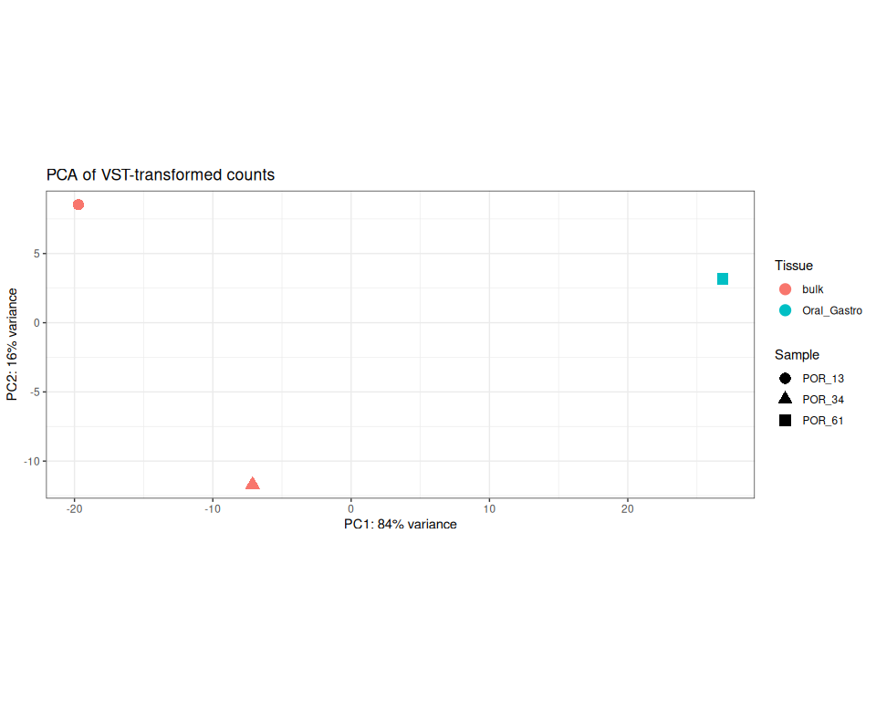<!-- -->

``` r
save_ggplot(PCA_simple, "PCA", width = 8, height = 6)
```

``` r
pcaData <- plotPCA(vst, intgroup=c("tissue"), returnData=TRUE, ntop = nrow(vst))
percentVar <- round(100 * attr(pcaData, "percentVar"))

PCA_simple <- ggplot(data = pcaData, aes(x=PC1, y=PC2, color=tissue, shape=sample)) +
  geom_point(size=4) +
  xlab(paste0("PC1: ",percentVar[1],"% variance")) +
  ylab(paste0("PC2: ",percentVar[2],"% variance")) + 
  labs(color = "Tissue", shape = "Sample") +
  coord_fixed() + theme_bw() + ggtitle("PCA of VST-transformed counts")

print(PCA_simple)
```

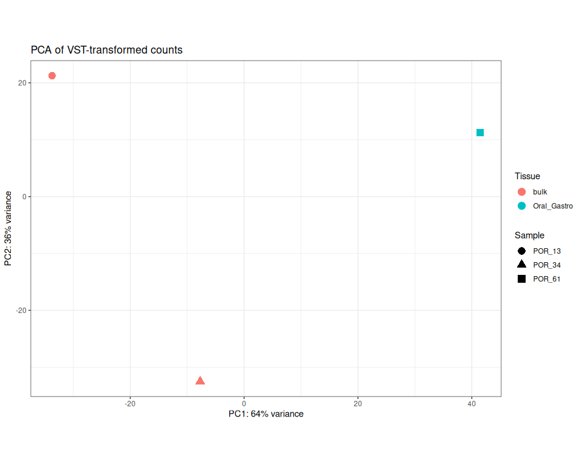<!-- -->

``` r
save_ggplot(PCA_simple, "PCA_allGenes", width = 8, height = 6)
```

### Hierarchical Clustering

``` r
sampleTree <- hclust(dist(t(vst_mat)), method = "average")

par(mar = c(8, 4, 2, 2))
plot(sampleTree,
     xlab = "", sub = "", cex = 0.7)
abline(h = 100, col = "red", lty = 2)
```

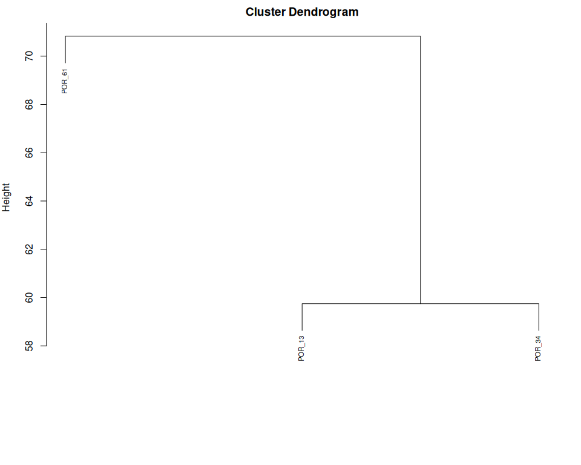<!-- -->

### Heatmap of variable genes

``` r
topVarGenes <- head(order(rowVars(vst_mat), decreasing=TRUE), 500)

png("../output_RNA/analysis/plots/top500vargenes_heatmap.png", width = 2000, height = 2400, res = 300)
pheatmap(vst_mat[topVarGenes, ], cluster_rows=TRUE, show_rownames=FALSE,
         cluster_cols=TRUE, cutree_cols = 2,
         annotation_col= meta %>% select(tissue))
```

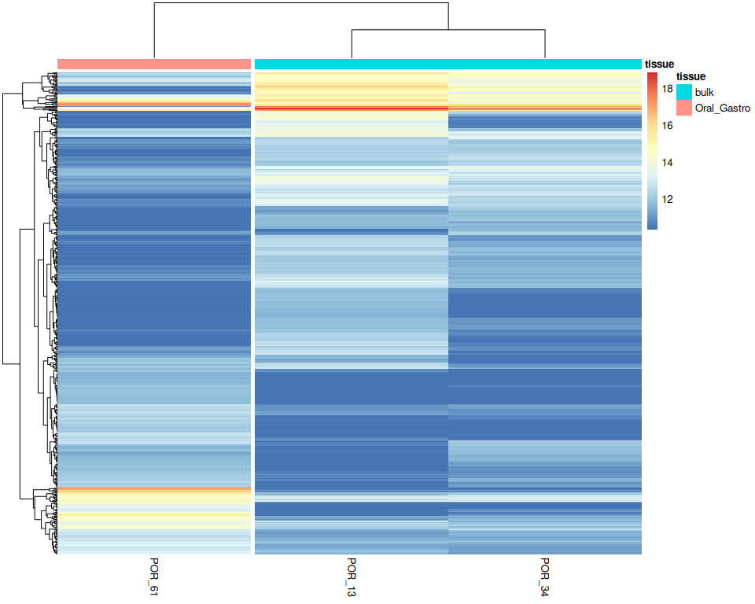<!-- -->

``` r
dev.off()
```

    ## png 
    ##   3

## Preprocessing Summary

    ## Preprocessing Summary:

    ## Input

    ## ----------------------------------------

    ##   Initial genes: 44130

    ## Filtering

    ## ----------------------------------------

    ##   Low-expression genes removed: 23792

    ##   pOverA filter: >= 10 counts in >= 33 % of samples

    ## Output

    ## ----------------------------------------

    ##   Final genes: 20338

    ##   Final samples: 3

    ##   Output directory: ../output_RNA/analysis

    ## QC Notes

    ## ----------------------------------------

    ##   Size factors range: 0.76 - 1.34

    ##   VST appropriate: Yes

    ##   PC1 variance: 64 %

    ##   PC2 variance: 36 %

# DE Analysis

## 1. Extract results for bulk vs. OralGastro contrast

``` r
resultsNames(dds)
```

    ## [1] "Intercept"                  "tissue_Oral_Gastro_vs_bulk"

``` r
res <- results(dds, name="tissue_Oral_Gastro_vs_bulk")
```

### MA Plots with Log2 Fold Change Transform Comparisons

``` r
resNorm <- lfcShrink(dds, coef="tissue_Oral_Gastro_vs_bulk", type="normal")
resAsh <- lfcShrink(dds, coef="tissue_Oral_Gastro_vs_bulk", type="ashr")
resLFC <- lfcShrink(dds, coef="tissue_Oral_Gastro_vs_bulk", res=res, type = "apeglm")

par(mfrow=c(1,4), mar=c(4,4,2,1))
xlim <- c(1,1e5); ylim <- c(-20,20)
plotMA(res, xlim=xlim, ylim=ylim, main="no LFC transform")
plotMA(resLFC, xlim=xlim, ylim=ylim, main="apeglm")
plotMA(resNorm, xlim=xlim, ylim=ylim, main="normal")
plotMA(resAsh, xlim=xlim, ylim=ylim, main="ashr")
```

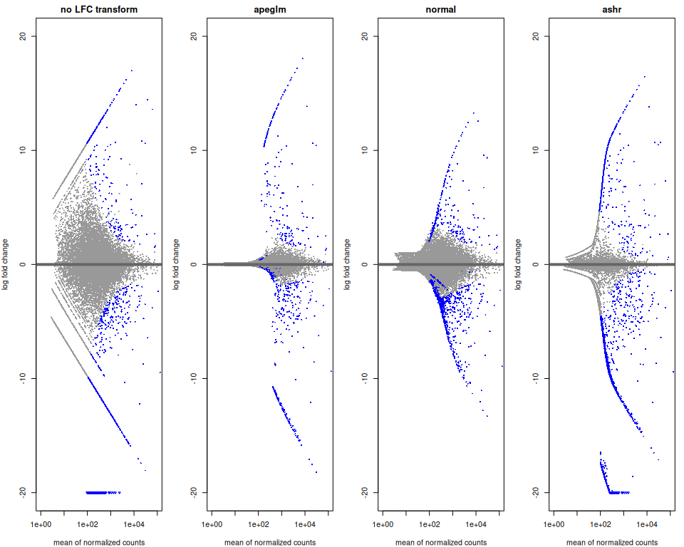<!-- -->

## 2. Extract results for adjusted p-value \< 0.05 with LFC transform of choice (or none)

``` r
res <- resLFC #resAsh

resOrdered <- res[order(res$pvalue),] # save differentially expressed genes
 
DE_05 <- as.data.frame(resOrdered) %>% filter(padj < 0.05)#& abs(log2FoldChange) > 1)
DE_05_Up <- DE_05 %>% filter(log2FoldChange > 0) #Higher in Oral Gastro
DE_05_Down <- DE_05 %>% filter(log2FoldChange < 0) #Lower in Oral Gastro

nrow(DE_05)
```

    ## [1] 1478

``` r
nrow(DE_05_Up) #Higher in Oral Gastro
```

    ## [1] 304

``` r
nrow(DE_05_Down) #Lower in Oral Gastro
```

    ## [1] 1174

### Join with annotation data

``` r
DE_05$query <- rownames(DE_05)
resOrdered$query <- rownames(resOrdered)

DESeq_SwissProt <- as.data.frame(resOrdered) %>% left_join(SwissProt) %>% select(query,everything())
DESeq_SwissProt$short_name <- ifelse(nchar(DESeq_SwissProt$ProteinNames) > 50,
                            paste0(substr(DESeq_SwissProt$ProteinNames, 1, 47), "..."),
                            DESeq_SwissProt$ProteinNames)

DE_05_SwissProt <- DESeq_SwissProt %>% filter(query %in% DE_05$query)
```

### Save csvs

``` r
write.csv(DESeq_SwissProt,
          file = file.path(outdir, "DESeq_results.csv"))

write.csv(DE_05_SwissProt,
          file = file.path(outdir, "DEG_05.csv"))
```

## 3. Heatmap of differentially expressed genes, with Swissprot annotation

``` r
gene_labels <- DESeq_SwissProt %>%
  select(query,short_name) %>%
  mutate_all(~ ifelse(is.na(.), "", .)) #replace NAs with "" for labelling purposes


DESeq_SwissProt$med_name <- ifelse(nchar(DESeq_SwissProt$ProteinNames) > 80,
                            paste0(substr(DESeq_SwissProt$ProteinNames, 1, 77), "..."),
                            DESeq_SwissProt$ProteinNames)

gene_labels_full <- DESeq_SwissProt %>%
  select(query,med_name) %>%
  mutate_all(~ ifelse(is.na(.), "", .)) #replace NAs with "" for labelling purposes
```

``` r
#view most significantly differentially expressed genes in order by p-value with labels
topDEGenes <- order(res$padj)[1:50]

heat1 <- pheatmap(vst_mat[topDEGenes, ],
         cluster_rows=TRUE, show_rownames=TRUE,
         cluster_cols=TRUE, cutree_cols = 2,
         annotation_col=(meta%>% select(tissue)),
         labels_row = gene_labels[match(rownames(res)[topDEGenes],(gene_labels$query)),2], fontsize_row = 6)
```

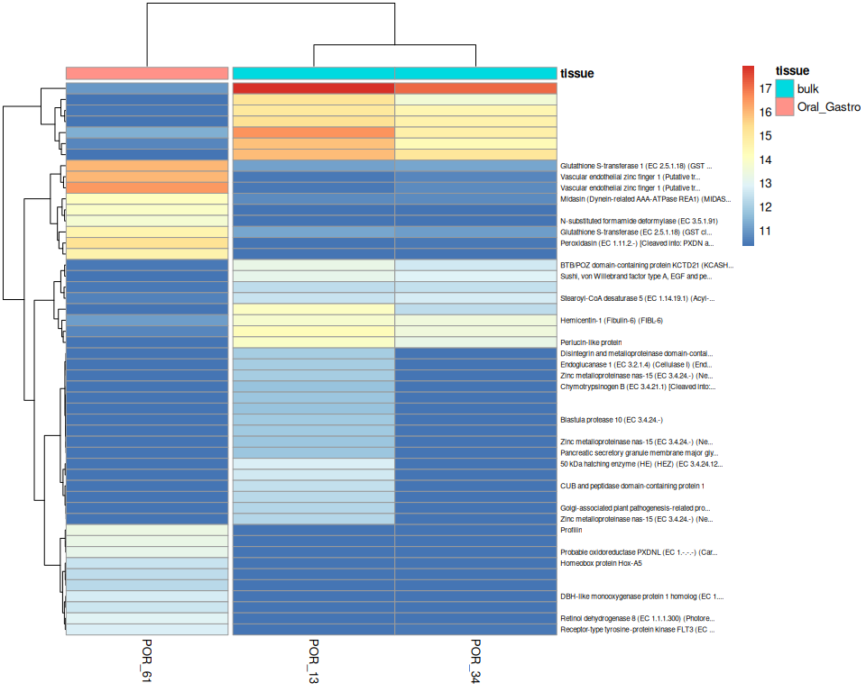<!-- -->

``` r
heat2 <- pheatmap(vst_mat[topDEGenes, ],
         cluster_rows=FALSE, show_rownames=TRUE,
         cluster_cols=TRUE, cutree_cols = 2,
         annotation_col=(meta%>% select(tissue)),
         labels_row = gene_labels[match(rownames(res)[topDEGenes],(gene_labels$query)),2], fontsize_row = 6)
```

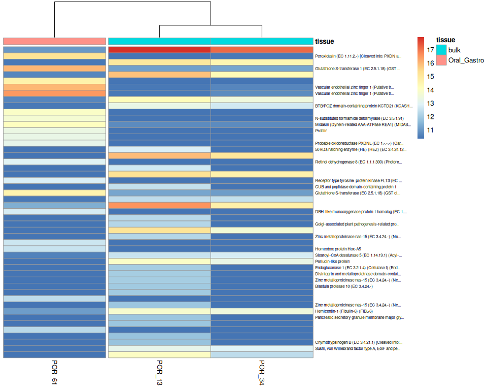<!-- -->

``` r
png("../output_RNA/analysis/plots/top50_DE_heatmap_swissprot.png", width = 2000, height = 2400, res = 300)
print(heat1)
dev.off()
```

    ## png 
    ##   2

``` r
png("../output_RNA/analysis/plots/top50_DE_ordered_heatmap_swissprot.png", width = 2000, height = 2400, res = 300)
print(heat2)
dev.off()
```

    ## png 
    ##   2

``` r
#view most significantly differentially expressed genes in order by LFC with labels
topDEGenes <- order(res$log2FoldChange)[1:50]

heat1 <- pheatmap(vst_mat[topDEGenes, ],
         cluster_rows=FALSE, show_rownames=TRUE,
         cluster_cols=TRUE, cutree_cols = 2,
         annotation_col=(meta%>% select(tissue)),
         labels_row = gene_labels[match(rownames(res)[topDEGenes],(gene_labels$query)),2], fontsize_row = 6)
```

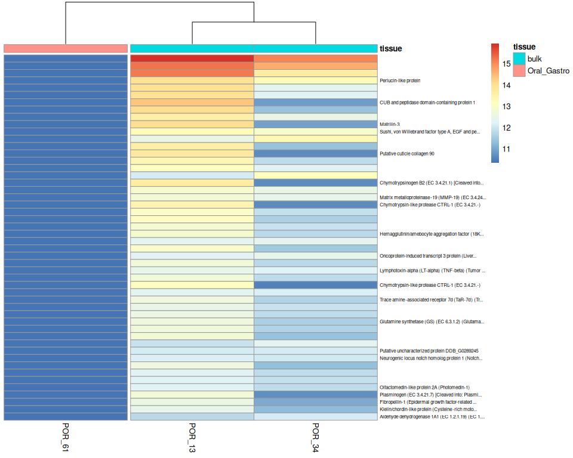<!-- -->

``` r
#view most significantly differentially expressed genes in order by LFC with labels
topDEGenes <- order(res$log2FoldChange, decreasing =  TRUE)[1:50]

heat2 <- pheatmap(vst_mat[topDEGenes, ],
         cluster_rows=FALSE, show_rownames=TRUE,
         cluster_cols=TRUE, cutree_cols = 2,
         annotation_col=(meta%>% select(tissue)),
         labels_row = gene_labels[match(rownames(res)[topDEGenes],(gene_labels$query)),2], fontsize_row = 6)
```

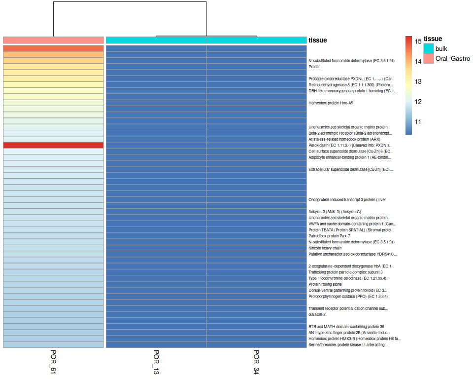<!-- -->

``` r
png("../output_RNA/analysis/plots/top50_LFC_ordered_heatmap_swissprot.png", width = 2000, height = 2400, res = 300)
print(heat1)
dev.off()
```

    ## png 
    ##   2

``` r
png("../output_RNA/analysis/plots/top50_LFC_up_ordered_heatmap_swissprot.png", width = 2000, height = 2400, res = 300)
print(heat2)
dev.off()
```

    ## png 
    ##   2

## 4. Genes of interest

### Solute Carrier (SLC) Family genes

``` r
solute_all <- DESeq_SwissProt %>% filter(grepl("Solute carrier", ProteinNames, ignore.case = TRUE))
solute_all <- solute_all %>%
  mutate(SLC_family = str_extract(ProteinNames, "Solute carrier family \\d+")) %>%
  mutate(SLC_family = str_replace(SLC_family,"Solute carrier family ", "SLC")) 

nrow(solute_all)
```

    ## [1] 292

``` r
solute_de <- DE_05_SwissProt %>% filter(grepl("Solute carrier", ProteinNames, ignore.case = TRUE))
solute_de <- solute_de %>%
  mutate(SLC_family = str_extract(ProteinNames, "Solute carrier family \\d+")) %>%
  mutate(SLC_family = str_replace(SLC_family,"Solute carrier family ", "SLC")) 

solute_de_upOG <- solute_de %>% filter(log2FoldChange > 0)
nrow(solute_de_upOG)
```

    ## [1] 9

``` r
solute_de_downOG <- solute_de %>% filter(log2FoldChange < 0)
nrow(solute_de_downOG)
```

    ## [1] 15

``` r
length(unique(solute_all$SLC_family))
```

    ## [1] 44

``` r
length(unique(solute_de_upOG$SLC_family))
```

    ## [1] 7

``` r
length(unique(solute_de_downOG$SLC_family))
```

    ## [1] 12

``` r
table(solute_de$SLC_family)
```

    ## 
    ## SLC15 SLC16  SLC2 SLC22 SLC24 SLC25 SLC31 SLC32 SLC34 SLC35 SLC39  SLC4 SLC46 
    ##     1     3     1     1     2     2     1     1     1     2     2     1     1 
    ## SLC49  SLC6  SLC7  SLC9 
    ##     1     1     1     2

``` r
#view most significantly differentially expressed genes in order by LFC with labels
heat1 <- pheatmap(vst_mat[solute_de$query, ],
         cluster_rows=TRUE, show_rownames=TRUE,
         cluster_cols=TRUE, cutree_cols = 2,
         annotation_col=(meta%>% select(tissue)),
         labels_row = gene_labels_full[match(solute_de$query,(gene_labels_full$query)),2], fontsize_row =9)
```

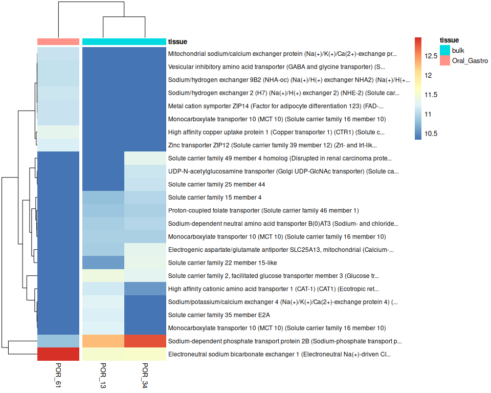<!-- -->

``` r
png("../output_RNA/analysis/plots/SLC_heatmap_swissprot.png", width = 4000, height = 2400, res = 300)
print(heat1)
dev.off()
```

    ## png 
    ##   2

### Biomin_genes

``` r
biomin <- read.csv("../../HI_genome_annotations/annotation/biomineralization/Pcomp_Biomin_Spis_ortholog.csv") %>% select(-X)

biomin_all <- biomin %>% inner_join(DESeq_SwissProt, join_by("Pcomp_gene"=="query"))

biomin_de <- biomin %>%  inner_join(DE_05_SwissProt, join_by("Pcomp_gene"=="query"))

biomin_de_upOG <- biomin_de %>% filter(log2FoldChange > 0)
nrow(biomin_de_upOG)
```

    ## [1] 2

``` r
biomin_de_downOG <- biomin_de %>% filter(log2FoldChange < 0)
nrow(biomin_de_downOG)
```

    ## [1] 15

``` r
heat1 <- pheatmap(vst_mat[biomin_de$Pcomp_gene, ],
         cluster_rows=TRUE, show_rownames=TRUE,
         cluster_cols=TRUE, cutree_cols = 2,
         annotation_col=(meta%>% select(tissue)),
         labels_row = biomin_de$definition, fontsize_row =9)
```

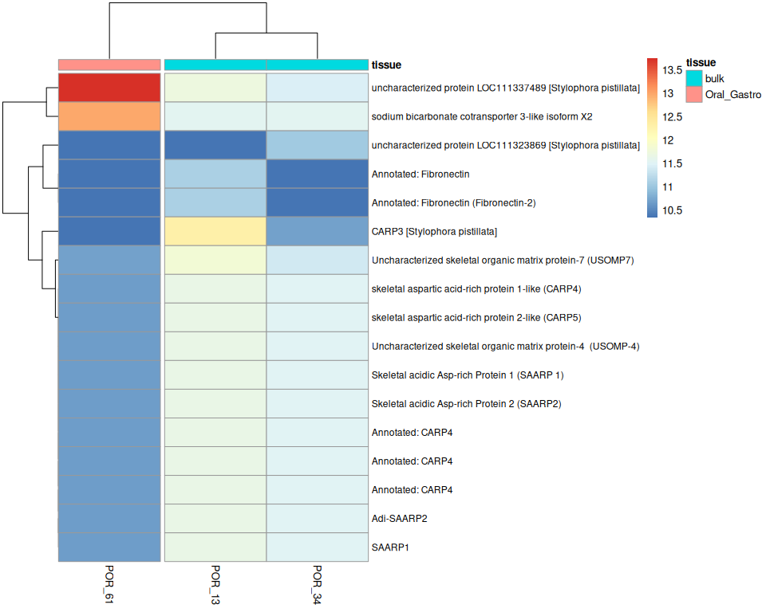<!-- -->

``` r
png("../output_RNA/analysis/plots/Biomin_heatmap.png", width = 4000, height = 2400, res = 300)
print(heat1)
dev.off()
```

    ## png 
    ##   2

``` r
heat1 <- pheatmap(vst_mat[biomin_de$Pcomp_gene, ],
         cluster_rows=TRUE, show_rownames=TRUE,
         cluster_cols=TRUE, cutree_cols = 2,
         annotation_col=(meta%>% select(tissue)),
         labels_row = gene_labels_full[match(biomin_de$Pcomp_gene,(gene_labels_full$query)),2], fontsize_row =9)
```

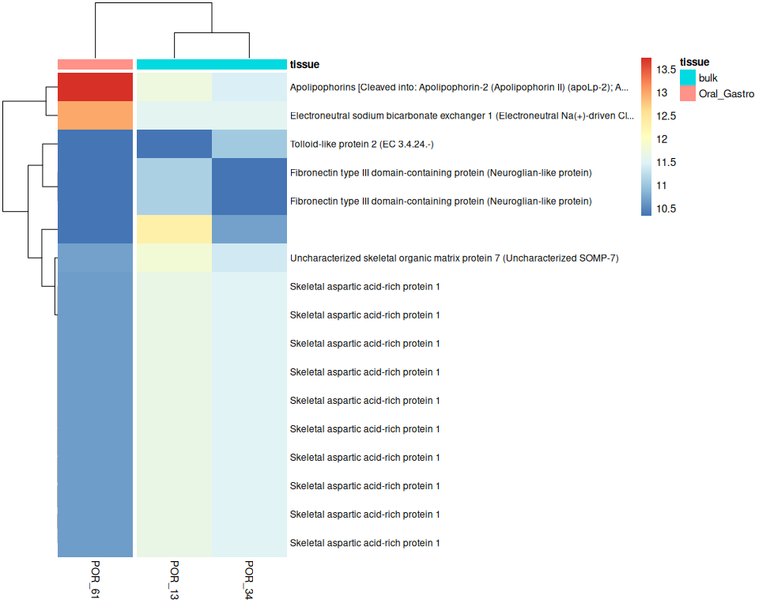<!-- -->

``` r
png("../output_RNA/analysis/plots/Biomin_heatmap_swissprot.png", width = 4000, height = 2400, res = 300)
print(heat1)
dev.off()
```

    ## png 
    ##   2

### Membrane genes

``` r
membrane <- read.csv("../../HI_genome_annotations/annotation/calcium_membrane_transport/Pcomp_membrane_channels.csv") %>%
  select(query,short_name,gene_set,Bhattacharya_ID) %>% dplyr::rename(pretty_name = short_name)

membrane_all <- membrane %>% inner_join(DESeq_SwissProt, join_by("query"=="query"))

membrane_de <- membrane %>%  inner_join(DE_05_SwissProt, join_by("query"=="query"))

membrane_de_upOG <- membrane_de %>% filter(log2FoldChange > 0)
nrow(membrane_de_upOG)
```

    ## [1] 7

``` r
membrane_de_downOG <- membrane_de %>% filter(log2FoldChange < 0)
nrow(membrane_de_downOG)
```

    ## [1] 12

``` r
heat1 <- pheatmap(vst_mat[membrane_de$query, ],
         cluster_rows=TRUE, show_rownames=TRUE,
         cluster_cols=TRUE, cutree_cols = 2,
         annotation_col=(meta%>% select(tissue)),
         labels_row = membrane_de$pretty_name, fontsize_row =9)
```

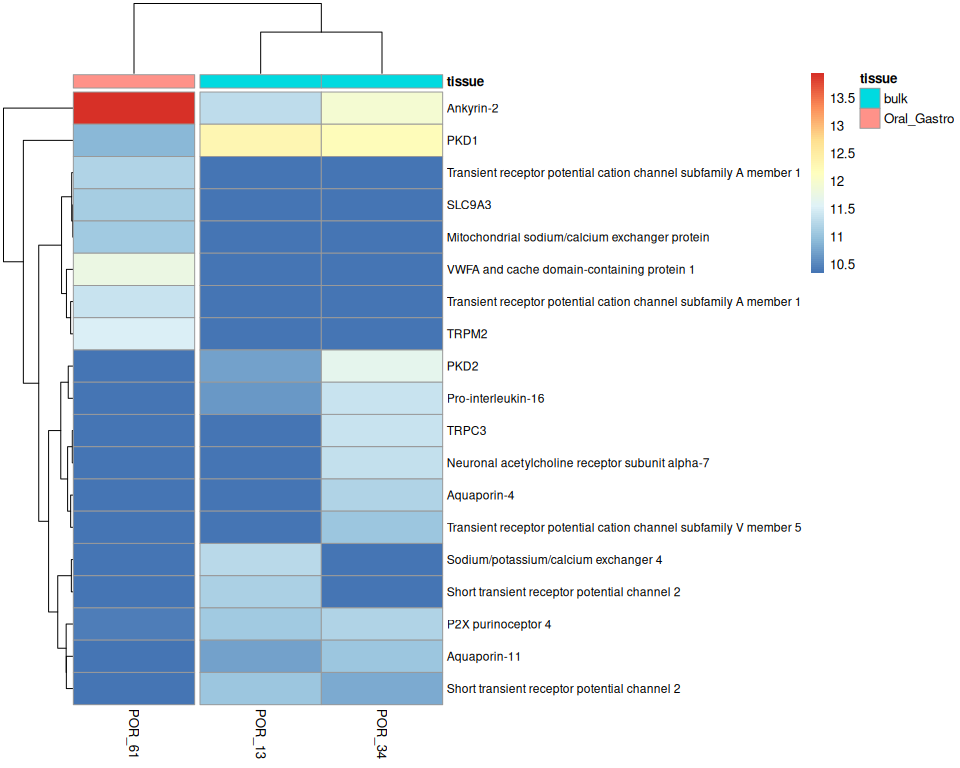<!-- -->

``` r
png("../output_RNA/analysis/plots/membrane_heatmap.png", width = 4000, height = 2400, res = 300)
print(heat1)
dev.off()
```

    ## png 
    ##   2

## Appendix

To knit:

rmarkdown::render(“scripts/DE_Analysis.Rmd”, output_dir = “./”)
